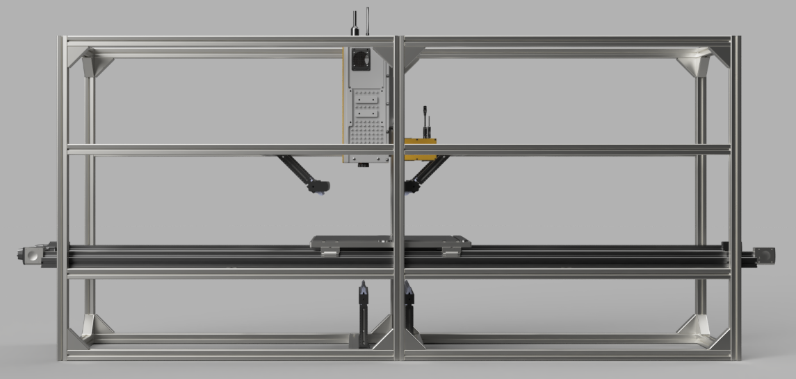
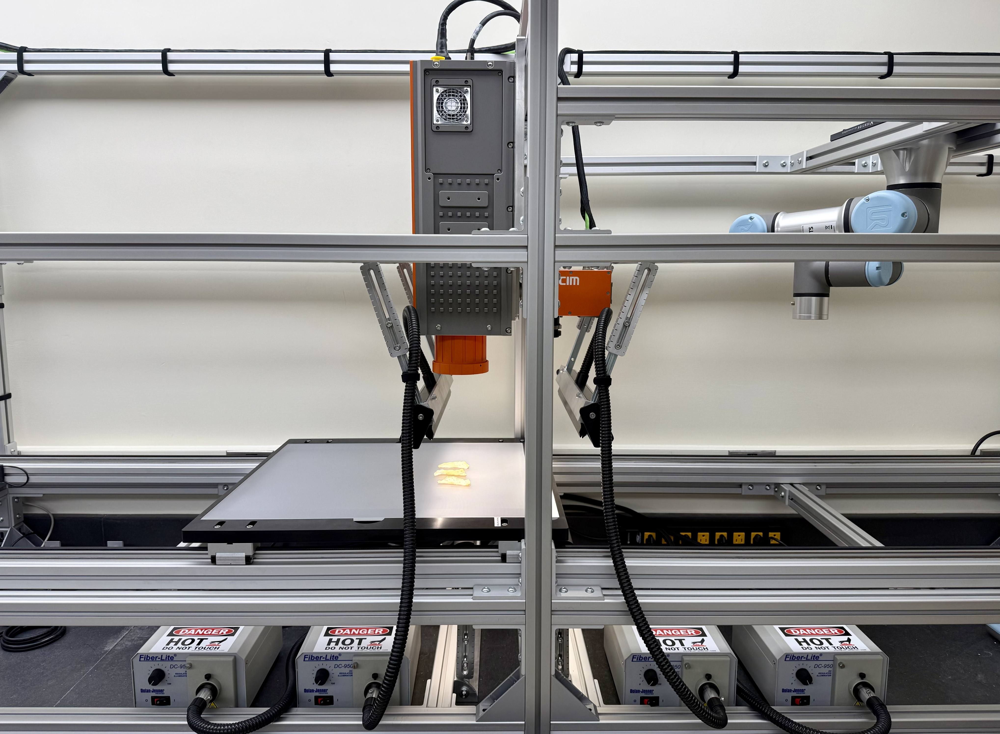
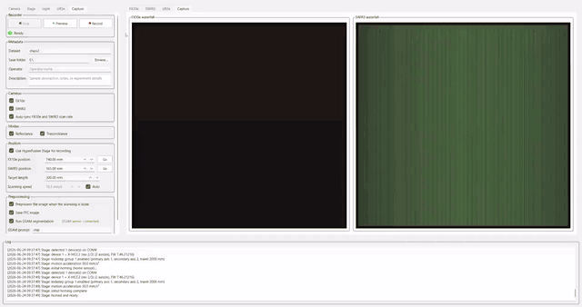

#  HyperFusion

**From visible to short-wave infrared, from reflectance to transmittance — one platform, one workflow, spectra that tell the whole story.**

HyperFusion is a multimodal hyperspectral imaging platform for food and agricultural sensing that combines **VNIR and SWIR imaging** in a single coordinated scan to capture complementary chemical and structural information. With **dual reflectance and transmittance imaging modes**, HyperFusion reveals both surface characteristics and internal optical properties, enabling applications including freshness and ripeness evaluation, moisture analysis, defect detection, foreign material inspection, and compositional characterization.

Designed for research and high-throughput phenotyping, HyperFusion integrates live visualization, synchronized dual-camera acquisition, automated calibration, hypercube fusion, and streamlined data export into a unified workflow. From acquisition to analysis-ready datasets, the platform supports optional flat-field correction, ENVI export, and AI-powered segmentation for downstream quality assessment and phenotyping.

  

  

  
   
  <a href="https://github.com/jy773Cornell/HyperFusion/raw/main/app/assets/HyperFusionDemo.mp4">▶ Watch full demo (MP4)</a>

---

## Features

- Simultaneous **VNIR and SWIR** hyperspectral acquisition
- Dual imaging modes: **reflectance** and **transmittance**
- Live visualization with detector view, waterfall view, spectral profile, and pixel profile
- Guided acquisition workflow with staged **dark reference**, **white reference**, sample scan, and optional transmittance scan
- Automatic synchronization of stage speed and camera line rate
- Automatic preprocessing after acquisition
- Optional **GSAM2** segmentation sidecar for automated sample segmentation
- Offline **dual-camera fusion**: spatial registration (VNIR ↔ SWIR alignment) and spectral fusion into unified ENVI cubes per chip
- Designed for food quality assessment, plant phenotyping, and hyperspectral imaging research

---

## Hardware

| Component                    | Description                                          |
| ---------------------------- | ---------------------------------------------------- |
| **FX10e + Pleora**           | VNIR hyperspectral line-scan camera                  |
| **SWIR3 + NI Frame Grabber** | SWIR hyperspectral line-scan camera                  |
| **Zaber Linear Stage**       | Precision sample translation for push-broom scanning |
| **MCC USB-1208**             | Reflectance and transmittance illumination control   |

---

## Documentation

| Guide                              | Audience      | Contents                                                                                                        |
| ---------------------------------- | ------------- | --------------------------------------------------------------------------------------------------------------- |
| **[SETUP.md](SETUP.md)**           | Developers    | SDK installation, drivers, build environment, `hyperfusion.cfg`, deployment, and application configuration      |
| **[tools/README.md](tools/README.md)** | Installers | Stage a payload and install the app (`package_release.ps1`, `Install-HyperFusion.ps1`) |
| **[USERMANUAL.md](USERMANUAL.md)** | Lab operators | User interface, hardware connection, imaging workflow, calibration, capture, configuration, and troubleshooting |

---

## Authors

**Jinhong Yu**  
Lead Developer & Research Engineer  
Ph.D. Student, Cornell Postharvest Technologies Lab, Cornell University
Email: [jy773@cornell.edu](mailto:jy773@cornell.edu)

---

## License

This project is intended for research and academic use. See the repository license for details.